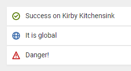

# Kirby Panel Checklists

Create automatic checklists inside the panel. You can test anything you want.

- **Version:** 0.1 alpha
- **Requirement:** Kirby 3
- [Changelog](docs/changelog.md)
- [Disclaimer](https://devonera.se/docs/disclaimer/?user=jenstornell&plugin=kirby-panel-checklists)
- [Donate](https://devonera.se/docs/donate/?user=jenstornell&plugin=kirby-panel-checklists)

## Screenshot



## Setup

First you need to setup some tests. It's done in your config file.

*In the alpha version this plugin is limited to 1 checklist and it needs to be called `my_checklist` in order to work*

```
return [
  'jenstornell.checklists.lists' => [
    'my_checklist' => [
      function($page) {
        return [
          'text' => 'Success on ' . $page->title(),
          'color' => 'green',
          'icon' => 'check'
        ];
      },
      function($page) {
        return [
          'text' => 'It is global',
          'color' => 'blue',
          'icon' => 'globe'
        ];
      },
    ]
  ]
];
```

Each function represents one test and one list item. The available colors are blue, green, orange, black, red, gray.

## Blueprint

To see the field add the following into your blueprint.

```text
checklist:
  type: checklist
```

## Checklist ideas

You can test any anything you want. Below are a few ideas.

- SEO (Search Engine Optimization)
- Environment/security
- Content quality